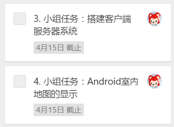
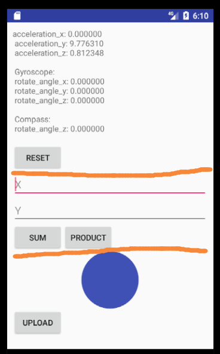

# Android 学习

Android 这次任务的 ddl 是两周，内容比较多，建议这周就开始。 需要完成两个任务：



## 任务一

第一个任务是网络通信，这个部分已经完成，引入了一个开源的 Android 通信框架 VolleyPlus，请按以下步骤来熟悉这个框架的使用：

1. Clone 项目至本地

    项目地址： https://github.com/GetYourLocation/GYL-Client

2. 使用真机运行

    程序第一个界面只有一个 TEST 按钮，点击进入测试页面：

    

    页面数据分为三个部分（橘色线分隔）：传感器数据测试、GET/POST 请求测试、图片上传测试。传感器数据上周接触过这里不多讲。中间的 SUM 是个 GET 请求，用来求和，PRODUCT 是 POST 请求，用来求乘积。点击底下蓝色的圆将从手机相册选择图片，点击 UPLOAD 进行上传，上传成功的图片将会显示在 UPLOAD 按钮下方。
    （注：上传图片大小限制为 2M，并且一次只能上传一张，想上传第二张请重新打开该页面）

    请测试上面提到的所有功能。

3. 熟悉目录结构

    ```
    - com.getyourlocation.app.gyl_client
        - util                  // 存放工具类（可以略看）
            - CommonUtil.java   // 通用函数
            - NetworkUtil.java  // 网络请求相关函数
            - SensorUtil.java   // 传感器数据相关函数
        - MainActivity.java     // 主界面，目前只有一个 TEST 按钮
        - TestActivity.java     // 测试界面，步骤2中显示的界面，需要详细阅读，弄清楚每行代码
    ```

4. 熟悉代码

    主要看 TestActivity.java 的源码，弄清楚**如何发送 GET 和 POST 请求**以及**如何上传图片与下载图片**。

    服务器提供三个 API 接口：

    - 求和（GET）：

        | Param | Description |
        |-------|-------------|
        |x|第一个加数|
        |y|第二个加数|

        当 x=7，y=5 时，返回如下 JSON：

        ```json
        {"ans": 12}
        ```

    - 求乘积（POST）：

        | Param | Description |
        |-------|-------------|
        |x|第一个乘数|
        |y|第二个乘数|

        当 x=7，y=5 时，返回如下 JSON：

        ```json
        {"ans": 35}
        ```

    - 上传文件（POST）：

        | Param | Description |
        |-------|-------------|
        |file|文件二进制串（byte array）|

        文件可以批量上传，返回一个 JSON 数组，表示已经成功上传的图片的 URI 集合：

        ```json
        [
            "/gyl/upload_files/5de967bb5432488b92b11539e59be97c.jpeg",
            "/gyl/upload_files/5de967bb5432488b92b16854e59be97c.jpeg"
        ]
        ```

        将服务器 IP 与上面 URI 拼接即可得到图片路径。

## 任务二

第二个任务要使用第三方平台来显示地图，需要你们四个人一起研究一下[图聚智能](http://www.palmap.cn/)这个平台怎么用、怎么把室内地图显示出来等等。

**（有任何问题尽快在群上问，内容较多，不要等到 DDL 快到了再来搞）**