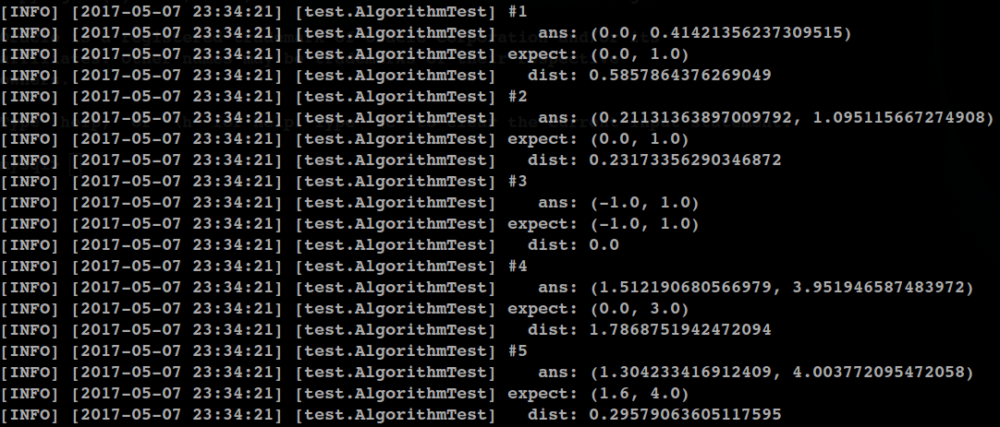

# 后端单元测试说明

目前后端已经实现了三角定位算法，为了便于测试我加入了单元测试框架 JUnit，JUnit 应该都不陌生，之前实训的时候用过。

输入以下命令运行单元测试：

```bash
$ mvn clean test
```

目前加入了5个三角定位算法的测试用例，运行完上述命令可以看到如下输出：



其中，`dist`表示实际位置和预期位置的距离。

单元测试的源文件在 `test/java` 目录下，目前只有 `BaseTest.java` 和 `AlgorithmTest.java` 两个类，`BaseTest`是所有单元测试类的基类，直接看 `AlgorithmTest` 类即可：

```java
public class AlgorithmTest extends BaseTest {

    private static final Logger Log = LoggerFactory.getLogger(AlgorithmTest.class);
    private int triangularCnt = 1;

    @Test
    public void testTriangular() throws Exception {
        testTriangular(45, 45, -1, 0, 0, -1, 1, 0, new double[]{0, 1});
        testTriangular(60, 60, -1.732, 0, 0, -1, 1.732, 0, new double[]{0, 1});
        testTriangular(45, 45, -1, -1, 1, -1, 1, 1, new double[]{-1, 1});
        testTriangular(90, 53, -4, 0, 0, 0, 4, 3, new double[]{0, 3});
        testTriangular(25.43, 76.9, -1.8, 3.8, 1, 0.5, 2.5, 0.8, new double[]{1.6, 4});
    }

    private void testTriangular(double alpha, double beta,
                                double x1, double y1,
                                double x2, double y2,
                                double x3, double y3, double[] expect) {
        double[] ans = Algorithm.triangular(alpha, beta, x1, y1, x2, y2, x3, y3);
        Log.info("#" + triangularCnt++);
        Log.info("   ans: (" + ans[0] + ", " + ans[1] + ")");
        Log.info("expect: (" + expect[0] + ", " + expect[1] + ")");
        Log.info("  dist: " + Algorithm.distance(ans, expect));
    }
}
```

带有注解 `@Test` 的方法会在运行测试的时候被执行，该方法里面5行分别对应的上面截图的5个测试用例的输出，后面想加新的用例直接照这个继续写就行啦。