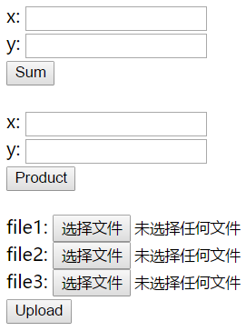

# 后端学习 #2

这次没有编码工作，两个内容：弄清楚 GET 和 POST 的区别；熟悉上传文件与下载文件的原理。

项目地址： https://github.com/GetYourLocation/GYL-Server

1. 为了与后期程序兼容，请将 Python 更新到 3.6+。（[官网](https://www.python.org/downloads/)）

2. 后端功能测试

    服务器开启后，访问 `http://localhost:8000/gyl`，可以看到三个表单，分别完成求和（GET）、求乘积（POST）、上传文件（POST）功能。

    

    请测试上面三个功能，文件上传成功之后返回的是由文件资源 URI 组成的 JSON 数组，将服务器 IP 与 URL 拼接可以得到文件路径，访问该路径查看文件是否上传成功。（注：文件大小不能超过 2M）

3. 了解 GET 和 POST 区别。

    用 Wireshark 对上面三个功能进行抓包，分析数据包内容。（GET、POST 的 data 部分有什么区别，一个文件是如何传输的等等）

4. 熟悉三个功能的编码实现

    三个功能的实现在 APIController.java 类中，求和和求乘积两个功能和上次一样，对照一下看一下比较好的写法是什么样的。

    文件上传之后将会保存在 `src/main/webapp/upload_files` 目录下，因此第 1 步里除了通过访问 URI 来查看文件是否上传成功之外，直接访问该目录也可以看到成功上传的文件。

    文件上传使用 POST 方法，接收两个参数：

    | Param | Description |
    |-------|-------------|
    |file|文件二进制串（byte array）|
    |ext|文件扩展名|

    upload() 方法将客户端上传的文件写入磁盘，并且将文件的 URI 返回给客户端，弄清楚这个方法里每一行代码在做什么即可。
