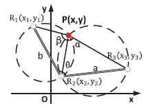
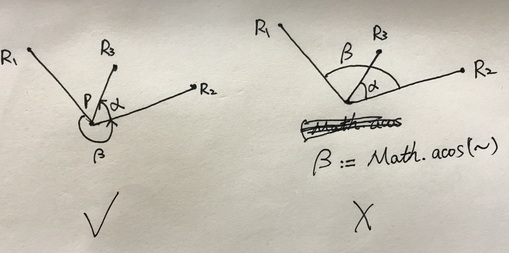
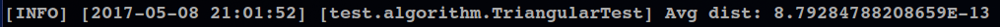

# 定位算法测试结果报告

三角定位采取了两种实现方式，第一种是 Sextant 论文给出的算法：

```java
{   // Sextant Algorithm
    double a = Point.dist(p2, p3);
    double b = Point.dist(p2, p1);
    double theta = Math.toDegrees(Math.acos((x2 * x2 + y2 * y2 - x1 * x2 - y1 * y2 -
        x2 * x3 - y2 * y3 +x1 * x3 + y1 * y3) / (a * b)));
    double cotA = cot(alpha);
    double sinB = Math.sin(Math.toRadians(beta));
    double sinBT = Math.sin(Math.toRadians(beta + theta));
    double cosBT = Math.cos(Math.toRadians(beta + theta));
    double denominator = Math.pow(b * sinBT - a * sinB, 2) + Math.pow(b * cosBT + a * sinB * cotA, 2);
    double x0 = a * b * (sinBT * cotA + cosBT) * (a * sinB * cotA + b * cosBT) / denominator;
    double y0 = a * b * (sinBT * cotA + cosBT) * (b * sinBT - a * sinB) / denominator;
    x = x0 * ((x3 - x2) / a) - y0 * ((y3 - y2) / a) + x2;
    y = x0 * ((y3 - y2) / a) + y0 * ((x3 - x2) / a) + y2;
}
```

另一种是 ToTal 算法，该算法在准确率和计算速度上远高于第一种：

```java
{   // ToTal algorithm: http://www.telecom.ulg.ac.be/triangulation
    double tmpX1 = x1 - x2;
    double tmpY1 = y1 - y2;
    double tmpX3 = x3 - x2;
    double tmpY3 = y3 - y2;
    double t12 = cot(beta);
    double t23 = cot(alpha);
    double t31 = (1 - t12 * t23) / (t12 + t23);
    double tmpX12 = tmpX1 + t12 * tmpY1;
    double tmpY12 = tmpY1 - t12 * tmpX1;
    double tmpX23 = tmpX3 - t23 * tmpY3;
    double tmpY23 = tmpY3 + t23 * tmpX3;
    double tmpX31 = tmpX3 + tmpX1 + t31 * (tmpY3 - tmpY1);
    double tmpY31 = tmpY3 + tmpY1 - t31 * (tmpX3 - tmpX1);
    double tmpK31 = tmpX1 * tmpX3 + tmpY1 * tmpY3 + t31 * (tmpX1 * tmpY3 - tmpX3 * tmpY1);
    double d = (tmpX12 - tmpX23) * (tmpY23 - tmpY31) - (tmpY12 - tmpY23) * (tmpX23 - tmpX31);
    x = x2 + tmpK31 * (tmpY12 - tmpY23) / d;
    y = y2 + tmpK31 * (tmpX23 - tmpX12) / d;
}
```

## 测试

示意图：



上面两个角度值在生成测试数据时容易出错：

- alpha：边 PR2 沿逆时针方向绕点 P 旋转至边 PR3 时所扫过的角度。
- beta：边 PR1 沿逆时针方向绕点 P 旋转至边 PR2 时所扫过的角度。

注意到这两个角度的值域是 `(0, 2pi)` 而不是 `(0, pi)`，如果直接使用 `Math.acos()` 方法计算这两个角度，由于该函数的值域是 `(0, pi)`，会导致两个角度计算错误。 图示如下：



较为简单的生成测试数据的方法是使用极坐标：固定一个点作为用户位置，选择初始极径和初始旋转角，表示第一个点 R1，接着随机生成 `(0, pi)` 内的旋转角作为 beta 值，生成第二个点 R2，重复此过程生成 alpha 值以及第三个点 R3。

实际测试中，固定用户位置为 `(50,50)`，极径范围在1~1000，重复运行测试程序1000次，计算定位结果与点 `(50,50)` 的距离值的期望，结果如下：



期望值接近于0，定位结果精确。
