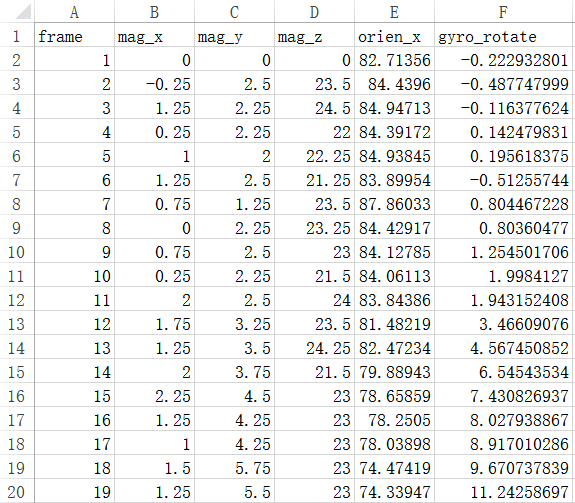

# 数据采集准备

1. 安装最新 [apk](https://github.com/GetYourLocation/GYL-Client/raw/master/apk/gyl-client.apk)

    主要更新内容：`pos.txt` 和 `sensor.txt` 后缀名改为 `.csv`，可以在手机或 PC 上直接用 Excel 查看数据：

    

    上图为 `sensor.csv` 的内容，每帧的传感器数据更新为 6 列，分别是帧序号、x 轴磁场强度、y 轴磁场强度、z 轴磁场强度、罗盘水平方向读数、基于陀螺仪计算的水平方向旋转角。

    最后两列数据可以用来计算录制过程中两帧图像之间的旋转角（求差值即可），这两列数据是采用两种不同的方法采集到的，计算旋转角可能各有优劣。

2. 测试最新 apk 的数据采集功能。

    1. 进入 Sensor/Network 页面，点击 CALIBRATE 按钮进行**陀螺仪校准**，校准一次即可。
    2. 进入 Collect data 页面，确保视频能正常录制，`frames`、`pos.csv` 和 `sensor.csv` 文件可以正确生成。
    3. 录制时测试一下旋转角的计算，比如逆时针旋转 90 度，然后利用 `sensor.csv` 最后两列数据来计算旋转角，看结果是否接近 90 度。

3. 采集过程注意事项（重要）

    1. 每次录制时**逆时针**（从上往下看）旋转设备。
    2. 每次录制时旋转角**不超过 180 度**。
    4. 录制过程中注意每隔一段时间让设备静止一下，进行自动对焦，让拍出来的招牌清晰一些。
    5. 手机尽量留出更多的存储空间。
    6. 手机电量要充满，传感器数据采集和视频录制都是很耗电的。

    **如果有问题一定要尽快提出来，尽量避免在采集过程中碰到 bug**
